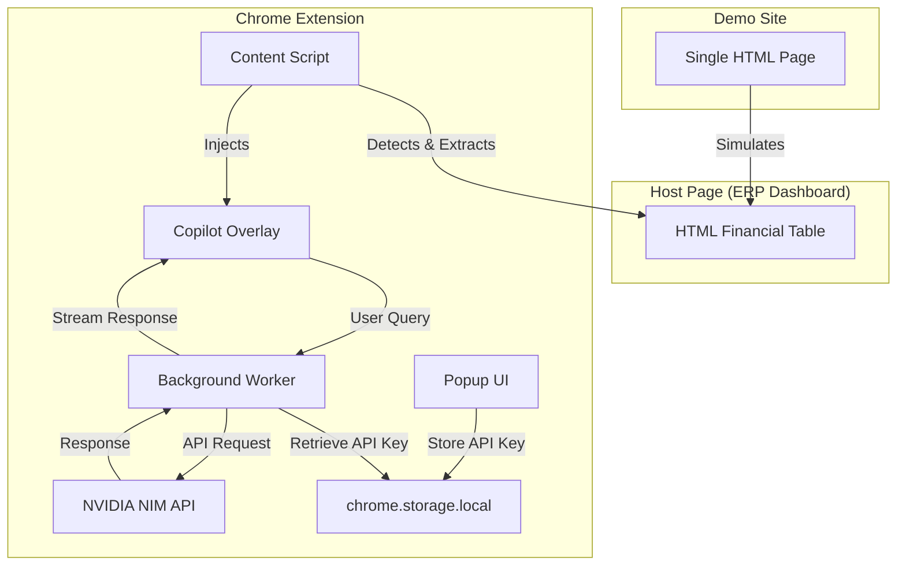

# Design Document: Finance Copilot Chrome Extension

## Overview

Finance Copilot is a Chrome browser extension built with the Plasmo framework that enhances legacy ERP dashboards with AI-powered financial analysis capabilities. The system consists of two primary components:

1. **Chrome Extension**: A Plasmo-based extension that detects financial tables on web pages, extracts structured data, and injects an interactive overlay providing flux analysis, AI chat, and migration simulation features.
2. **Demo Site**: A self-contained single-page HTML application simulating a QuickBooks-style ERP dashboard for "Meridian Supply Co." with FY2024 P&L data.

The extension leverages the NVIDIA NIM API (OpenAI-compatible endpoint) to provide natural-language financial insights. The architecture prioritizes browser security best practices, isolated styling, and seamless integration with existing web applications.

### Key Design Goals

- **Non-invasive Integration**: Inject overlay without disrupting host page functionality or styling
- **Secure API Communication**: Isolate API calls in background worker with secure key storage
- **Responsive UI**: Provide immediate feedback with streaming responses and real-time variance analysis
- **Portfolio Demonstration**: Showcase browser engineering, AI orchestration, and modern web development practices
- **Zero-Configuration Demo**: Enable immediate evaluation via public demo site

## Architecture

### High-Level System Architecture



### Component Interaction Flow

1. **Page Load**: Content script scans DOM for financial tables
2. **Detection**: Identifies tables with label columns and currency-formatted numeric columns
3. **Extraction**: Parses table into structured Financial_Dataset JSON
4. **Injection**: Injects Copilot_Overlay into host page with isolated styles
5. **Flux Analysis**: Automatically computes period-over-period variances
6. **User Interaction**: User submits natural-language queries via Chat_Interface
7. **API Communication**: Background worker authenticates and calls NVIDIA NIM API
8. **Response Streaming**: Chat responses stream back to overlay UI
9. **Migration View**: Static comparison renders legacy vs. modern UI representations

### Technology Stack

**Chrome Extension:**
- **Framework**: Plasmo (React-based Chrome extension framework)
- **UI Library**: React 18 with TypeScript
- **Styling**: Tailwind CSS with Shadow DOM isolation
- **State Management**: React hooks + chrome.storage.local
- **API Client**: Fetch API in background worker
- **Build Tool**: Plasmo CLI (handles manifest, bundling, HMR)

**Demo Site:**
- **Structure**: Single HTML file
- **Styling**: Tailwind CSS CDN
- **Deployment**: Vercel static hosting
- **No Build Step**: Direct HTML/CSS/inline JS

**External Services:**
- **NVIDIA NIM API**: `https://integrate.api.nvidia.com/v1/chat/completions`
- **Model**: `meta/llama-3.1-70b-instruct`
- **Authentication**: Bearer token (user-provided API key)

## Components and Interfaces

### 1. Content Script (`content.ts`)

**Responsibility**: Table detection, data extraction, overlay injection

**Key Functions:**

```typescript
interface ContentScriptAPI {
  // Scan DOM for financial tables on page load
  scanForFinancialTables(): FinancialTable[];
  
  // Classify table as financial based on column structure
  isFinancialTable(table: HTMLTableElement): boolean;
  
  // Extract structured data from detected table
  extractFinancialDataset(table: HTMLTableElement): FinancialDataset;
  
  // Inject overlay into host page
  injectCopilotOverlay(dataset: FinancialDataset): void;
  
  // Select primary table when multiple detected
  selectPrimaryTable(tables: FinancialTable[]): FinancialTable;
}
```

**Detection Algorithm:**
1. Query all `<table>` elements in document
2. For each table, analyze column structure:
   - Identify label columns (all cells contain non-numeric text)
   - Identify currency columns (all cells match currency pattern: `$`, `,`, optional decimals)
   - Require: ≥1 label column AND ≥2 currency columns
3. Rank tables by currency cell count
4. Select table with highest count (first in DOM order for ties)

**Extraction Algorithm:**
1. Identify header row (first `<thead>` row or first `<tr>`)
2. Extract period identifiers from header cells (skip label column)
3. For each data row:
   - Extract account label from first cell
   - Extract currency values from remaining cells
   - Parse currency: remove `$`, `,`, handle `()` or `-` as negative
   - Store as numeric value or `null` if unparseable
4. Serialize to Financial_Dataset JSON structure

**Injection Strategy:**
- Create Shadow DOM root for style isolation
- Mount React overlay component
- Apply `position: fixed` with high `z-index` (9999)
- Prevent event propagation to host page


### 2. Background Worker (`background.ts`)

**Responsibility**: API authentication, request proxying, CORS handling

**Key Functions:**

```typescript
interface BackgroundWorkerAPI {
  // Handle chat query from content script
  handleChatQuery(query: string, dataset: FinancialDataset): Promise<ChatResponse>;
  
  // Retrieve stored API key
  getApiKey(): Promise<string | null>;
  
  // Call NVIDIA NIM API with authentication
  callNimApi(messages: ChatMessage[], apiKey: string): Promise<ReadableStream>;
  
  // Handle API errors and timeouts
  handleApiError(error: Error): ErrorResponse;
}
```

**Message Passing:**
- Listen for `CHAT_QUERY` messages from content script
- Retrieve API key from `chrome.storage.local`
- Construct chat completion request with system prompt
- Stream response back to content script via message passing
- Handle 30-second timeout with AbortController

**System Prompt Template:**
```
You are a financial analysis assistant. The user is viewing financial data from their ERP dashboard.

Here is the financial data:
{serialized_dataset}

Answer the user's question concisely and accurately based only on this data. If the data doesn't contain the information needed, say so.
```

### 3. Popup UI (`popup.tsx`)

**Responsibility**: API key configuration and persistence

**Key Functions:**

```typescript
interface PopupAPI {
  // Load stored API key status on mount
  loadApiKeyStatus(): Promise<boolean>;
  
  // Validate and save API key
  saveApiKey(key: string): Promise<void>;
  
  // Display save confirmation or error
  showFeedback(type: 'success' | 'error', message: string): void;
}
```


**UI Layout:**
- Input field (max 512 chars) with password masking
- Save button (disabled when input empty/whitespace)
- Status indicator: "API Key Configured ✓" or "No API Key Set"
- Validation message area
- Link to NVIDIA NIM API documentation

**Validation Rules:**
- Trim whitespace before storage
- Reject empty or whitespace-only input
- Display inline error for invalid input
- Show success confirmation on successful save

### 4. Copilot Overlay (`overlay.tsx`)

**Responsibility**: Main UI container for all copilot features

**Key Functions:**

```typescript
interface CopilotOverlayAPI {
  // Initialize overlay with extracted dataset
  initialize(dataset: FinancialDataset): void;
  
  // Toggle overlay visibility
  toggleVisibility(): void;
  
  // Close overlay and cleanup
  close(): void;
  
  // Switch between feature tabs
  switchTab(tab: 'flux' | 'chat' | 'migration'): void;
}
```

**UI Structure:**
```
┌─────────────────────────────────────┐
│ Finance Copilot          [─] [×]    │
├─────────────────────────────────────┤
│ [Flux] [Chat] [Migration]           │
├─────────────────────────────────────┤
│                                     │
│  {Active Feature Component}         │
│                                     │
│                                     │
└─────────────────────────────────────┘
```

**Styling Isolation:**
- Render in Shadow DOM
- Import Tailwind CSS scoped to shadow root
- Use CSS custom properties for theming
- Prevent style leakage with `:host` selector


### 5. Flux Analysis Component (`flux-analysis.tsx`)

**Responsibility**: Automatic variance computation and visualization

**Key Functions:**

```typescript
interface FluxAnalysisAPI {
  // Compute period-over-period changes
  computeVariances(dataset: FinancialDataset): VarianceResult[];
  
  // Identify top 3 movers by absolute change
  identifyTopMovers(variances: VarianceResult[]): VarianceResult[];
  
  // Determine variance card color based on account type and direction
  getVarianceColor(account: string, change: number): 'green' | 'red' | 'amber' | 'neutral';
  
  // Classify account as revenue, expense, or other
  classifyAccount(label: string): 'revenue' | 'expense' | 'net-income' | 'other';
}
```

**Variance Computation:**
```typescript
// For each account row:
const currentPeriod = periods[periods.length - 1];
const priorPeriod = periods[periods.length - 2];
const currentValue = dataset[account][currentPeriod];
const priorValue = dataset[account][priorPeriod];

if (priorValue === null || priorValue === 0) {
  variance = 'N/A';
} else {
  variance = ((currentValue - priorValue) / priorValue) * 100;
  variance = Math.round(variance * 10) / 10; // Round to 1 decimal
}
```

**Color Logic:**
- **Revenue/Net Income**: Green if positive, Red if negative
- **Expenses**: Amber if positive (bad), Green if negative (good)
- **Other/Zero/N/A**: Neutral gray

**Account Classification:**
- Revenue: label contains "revenue", "sales", "income" (case-insensitive)
- Net Income: label contains "net income", "net profit"
- Expense: label contains "expense", "cost", "payroll", "marketing", etc.
- Other: default classification


**UI Layout:**
```
Top Movers (3)
┌──────────────────────────────┐
│ 🔥 Revenue          +15.3%   │ [Green]
│ 🔥 Marketing Exp.   +45.2%   │ [Amber]
│ 🔥 Net Income       +22.1%   │ [Green]
└──────────────────────────────┘

All Accounts
┌──────────────────────────────┐
│ Revenue             +15.3%   │
│ Cost of Goods Sold  +8.5%    │
│ Gross Profit        +18.2%   │
│ Marketing Expenses  +45.2%   │
│ ...                          │
└──────────────────────────────┘
```

### 6. Chat Interface Component (`chat-interface.tsx`)

**Responsibility**: Natural-language query handling with rate limiting

**Key Functions:**

```typescript
interface ChatInterfaceAPI {
  // Submit user query to background worker
  submitQuery(query: string): Promise<void>;
  
  // Stream response from background worker
  streamResponse(stream: ReadableStream): void;
  
  // Track and enforce query quota
  checkQuota(): boolean;
  
  // Display chat history
  renderChatHistory(messages: ChatMessage[]): JSX.Element;
}
```

**State Management:**
```typescript
interface ChatState {
  messages: ChatMessage[];
  queriesUsed: number;
  queryQuota: 20;
  isLoading: boolean;
  error: string | null;
}
```

**Query Flow:**
1. User enters question (max 1000 chars)
2. Validate: non-empty, quota available, API key configured
3. Increment query counter
4. Send to background worker with dataset
5. Display loading indicator
6. Stream response tokens as received
7. Append to chat history
8. Update remaining queries display


**UI Layout:**
```
┌─────────────────────────────────────┐
│ Chat History (Queries: 3/20)        │
├─────────────────────────────────────┤
│ You: What drove the revenue growth? │
│                                     │
│ AI: Revenue increased 15.3% from    │
│ Q3 to Q4, driven primarily by...    │
│                                     │
│ You: Compare Q1 vs Q4 expenses      │
│                                     │
│ AI: [Streaming response...]         │
├─────────────────────────────────────┤
│ [Type your question...]        [→]  │
└─────────────────────────────────────┘
```

**Error Handling:**
- No API key: "Please configure your API key in the extension popup"
- Quota exceeded: "Query limit reached (20/20). Reload page to reset."
- API error: "Failed to get response. Please try again."
- Timeout: "Request timed out. Please try again."
- Empty query: "Please enter a question"

### 7. Migration Modal Component (`migration-modal.tsx`)

**Responsibility**: Side-by-side legacy vs. modern UI comparison

**Key Functions:**

```typescript
interface MigrationModalAPI {
  // Open modal with comparison view
  openModal(dataset: FinancialDataset): void;
  
  // Close modal and return to overlay
  closeModal(): void;
  
  // Render legacy representation
  renderLegacy(dataset: FinancialDataset): JSX.Element;
  
  // Render modern DualEntry representation
  renderModern(dataset: FinancialDataset): JSX.Element;
}
```

**UI Layout:**
```
┌─────────────────────────────────────────────────────────┐
│ Simulate DualEntry Migration                       [×]  │
├──────────────────────┬──────────────────────────────────┤
│ Legacy ERP           │ Modern DualEntry                 │
│ [Desaturated/Blur]   │ [Dark Theme]                     │
│                      │                                  │
│ Account      Q1  Q2  │ Account          Q1         Q2   │
│ Revenue    $100 $115 │ Revenue      $100,000  $115,000 │
│ COGS        $60  $65 │ COGS          $60,000   $65,000 │
│ ...                  │ ...                              │
└──────────────────────┴──────────────────────────────────┘
```


**Visual Styling:**
- **Legacy**: Grayscale filter, 2px blur, traditional table styling
- **Modern**: Dark background (#1a1a1a), accent colors, improved typography, better spacing
- **Transition**: Smooth fade-in animation (300ms)
- **Modal**: Full-screen overlay with backdrop blur

### 8. Demo Site (`demo.html`)

**Responsibility**: Self-contained ERP dashboard simulation

**Structure:**
```html
<!DOCTYPE html>
<html>
<head>
  <title>Meridian Supply Co. - ERP Dashboard</title>
  <script src="https://cdn.tailwindcss.com"></script>
</head>
<body>
  <header>
    <h1>Meridian Supply Co.</h1>
    <p>FY2024 Financial Dashboard</p>
  </header>
  
  <main>
    <table id="financial-table">
      <thead>
        <tr>
          <th>Account</th>
          <th>Q1 2024</th>
          <th>Q2 2024</th>
          <th>Q3 2024</th>
          <th>Q4 2024</th>
        </tr>
      </thead>
      <tbody>
        <!-- Financial data rows -->
      </tbody>
    </table>
  </main>
</body>
</html>
```

**Financial Data (FY2024):**
| Account | Q1 | Q2 | Q3 | Q4 |
|---------|----|----|----|----|
| Revenue | $850,000 | $920,000 | $1,050,000 | $1,210,000 |
| Cost of Goods Sold | $425,000 | $460,000 | $525,000 | $605,000 |
| Gross Profit | $425,000 | $460,000 | $525,000 | $605,000 |
| Marketing Expenses | $85,000 | $92,000 | $105,000 | $152,500 |
| Payroll | $180,000 | $185,000 | $190,000 | $195,000 |
| Software & Tools | $25,000 | $28,000 | $30,000 | $32,000 |
| Travel & Entertainment | $15,000 | $18,000 | $22,000 | $28,000 |
| Office & Facilities | $35,000 | $36,000 | $37,000 | $38,000 |
| Net Income | $85,000 | $101,000 | $141,000 | $159,500 |

**Vercel Configuration (`vercel.json`):**
```json
{
  "routes": [
    { "src": "/", "dest": "/demo.html" }
  ]
}
```


## Data Models

### Financial_Dataset

The core data structure representing extracted financial information.

```typescript
interface FinancialDataset {
  // Metadata about the source table
  metadata: {
    sourceUrl: string;
    extractedAt: string; // ISO 8601 timestamp
    tableName?: string;
    companyName?: string;
  };
  
  // Array of period identifiers (e.g., ["Q1 2024", "Q2 2024", ...])
  periods: string[];
  
  // Map of account labels to period values
  accounts: {
    [accountLabel: string]: {
      [periodId: string]: number | null;
    };
  };
}
```

**Example:**
```json
{
  "metadata": {
    "sourceUrl": "https://demo.example.com",
    "extractedAt": "2024-01-15T10:30:00Z",
    "companyName": "Meridian Supply Co."
  },
  "periods": ["Q1 2024", "Q2 2024", "Q3 2024", "Q4 2024"],
  "accounts": {
    "Revenue": {
      "Q1 2024": 850000,
      "Q2 2024": 920000,
      "Q3 2024": 1050000,
      "Q4 2024": 1210000
    },
    "Cost of Goods Sold": {
      "Q1 2024": 425000,
      "Q2 2024": 460000,
      "Q3 2024": 525000,
      "Q4 2024": 605000
    }
  }
}
```

### VarianceResult

Computed period-over-period change for an account.

```typescript
interface VarianceResult {
  accountLabel: string;
  currentPeriod: string;
  priorPeriod: string;
  currentValue: number | null;
  priorValue: number | null;
  percentageChange: number | null; // null if N/A
  absoluteChange: number | null;
  isTopMover: boolean;
  accountType: 'revenue' | 'expense' | 'net-income' | 'other';
  color: 'green' | 'red' | 'amber' | 'neutral';
}
```


### ChatMessage

Message structure for chat history and API communication.

```typescript
interface ChatMessage {
  role: 'user' | 'assistant' | 'system';
  content: string;
  timestamp: string; // ISO 8601
}
```

### ChatState

Session state for chat interface.

```typescript
interface ChatState {
  messages: ChatMessage[];
  queriesUsed: number;
  queryQuota: 20;
  isLoading: boolean;
  error: string | null;
  dataset: FinancialDataset | null;
}
```

### StorageSchema

Chrome storage structure for persistent data.

```typescript
interface StorageSchema {
  // API key stored in chrome.storage.local
  'nim_api_key': string;
  
  // Session state (could be stored for persistence)
  'session_state': {
    queriesUsed: number;
    lastResetTimestamp: string;
  };
}
```

## API Integration

### NVIDIA NIM API

**Endpoint:** `https://integrate.api.nvidia.com/v1/chat/completions`

**Authentication:** Bearer token in `Authorization` header

**Request Format:**
```typescript
interface NimApiRequest {
  model: 'meta/llama-3.1-70b-instruct';
  messages: ChatMessage[];
  max_tokens: 300;
  temperature: 0.3;
  stream: true; // Enable streaming responses
}
```

**Example Request:**
```json
{
  "model": "meta/llama-3.1-70b-instruct",
  "messages": [
    {
      "role": "system",
      "content": "You are a financial analysis assistant..."
    },
    {
      "role": "user",
      "content": "What drove the revenue growth in Q4?"
    }
  ],
  "max_tokens": 300,
  "temperature": 0.3,
  "stream": true
}
```


**Response Format (Streaming):**
```
data: {"id":"chatcmpl-123","object":"chat.completion.chunk","choices":[{"delta":{"content":"Revenue"},"index":0}]}

data: {"id":"chatcmpl-123","object":"chat.completion.chunk","choices":[{"delta":{"content":" increased"},"index":0}]}

data: [DONE]
```

**Response Handling:**
```typescript
async function streamNimResponse(stream: ReadableStream): Promise<void> {
  const reader = stream.getReader();
  const decoder = new TextDecoder();
  
  while (true) {
    const { done, value } = await reader.read();
    if (done) break;
    
    const chunk = decoder.decode(value);
    const lines = chunk.split('\n').filter(line => line.trim().startsWith('data:'));
    
    for (const line of lines) {
      const data = line.replace('data: ', '');
      if (data === '[DONE]') return;
      
      try {
        const parsed = JSON.parse(data);
        const content = parsed.choices[0]?.delta?.content;
        if (content) {
          appendToChat(content);
        }
      } catch (e) {
        console.error('Failed to parse chunk:', e);
      }
    }
  }
}
```

### System Prompt Construction

```typescript
function buildSystemPrompt(dataset: FinancialDataset): string {
  const dataStr = JSON.stringify(dataset, null, 2);
  
  return `You are a financial analysis assistant helping a user understand their ERP dashboard data.

Here is the financial data currently visible to the user:

${dataStr}

Instructions:
- Answer questions concisely and accurately based ONLY on this data
- Use specific numbers and percentages when relevant
- If the data doesn't contain the information needed, say so clearly
- Format currency values with $ and commas (e.g., $1,234,567)
- Keep responses under 200 words
- Be professional but conversational`;
}
```

## State Management

### Chrome Storage (Persistent)

**API Key Storage:**
```typescript
// Save API key
await chrome.storage.local.set({ 'nim_api_key': apiKey });

// Retrieve API key
const result = await chrome.storage.local.get('nim_api_key');
const apiKey = result.nim_api_key;
```


### Session State (In-Memory)

**React State Management:**
```typescript
// Overlay state
const [dataset, setDataset] = useState<FinancialDataset | null>(null);
const [activeTab, setActiveTab] = useState<'flux' | 'chat' | 'migration'>('flux');
const [isVisible, setIsVisible] = useState(true);

// Chat state
const [messages, setMessages] = useState<ChatMessage[]>([]);
const [queriesUsed, setQueriesUsed] = useState(0);
const [isLoading, setIsLoading] = useState(false);

// Flux state
const [variances, setVariances] = useState<VarianceResult[]>([]);
const [topMovers, setTopMovers] = useState<VarianceResult[]>([]);
```

**Session Lifecycle:**
1. **Initialization**: Content script detects table → extracts dataset → injects overlay
2. **Active**: User interacts with features, state updates in React components
3. **Termination**: Page reload or tab close → all session state cleared
4. **Reset**: Query quota resets on new session initialization

### Message Passing

**Content Script ↔ Background Worker:**

```typescript
// Content script sends query
chrome.runtime.sendMessage({
  type: 'CHAT_QUERY',
  payload: {
    query: userQuestion,
    dataset: financialDataset
  }
}, (response) => {
  if (response.error) {
    handleError(response.error);
  } else {
    streamResponse(response.stream);
  }
});

// Background worker handles query
chrome.runtime.onMessage.addListener((message, sender, sendResponse) => {
  if (message.type === 'CHAT_QUERY') {
    handleChatQuery(message.payload)
      .then(response => sendResponse({ stream: response }))
      .catch(error => sendResponse({ error: error.message }));
    return true; // Keep channel open for async response
  }
});
```

## UI/UX Design

### Copilot Overlay Design

**Visual Hierarchy:**
1. **Header**: Branding + controls (minimize, close)
2. **Tab Navigation**: Feature switcher (Flux, Chat, Migration)
3. **Content Area**: Active feature component
4. **Footer**: Status indicators (query count, loading state)

**Responsive Behavior:**
- Fixed position: bottom-right corner
- Draggable header for repositioning
- Resizable (min: 400x500px, max: 800x800px)
- Collapse to icon when minimized


**Color Palette:**
```css
:root {
  --primary: #3b82f6;      /* Blue - primary actions */
  --success: #10b981;      /* Green - positive variances */
  --warning: #f59e0b;      /* Amber - negative expense changes */
  --danger: #ef4444;       /* Red - negative revenue changes */
  --neutral: #6b7280;      /* Gray - neutral/N/A */
  --background: #ffffff;   /* White - overlay background */
  --surface: #f9fafb;      /* Light gray - cards */
  --text: #111827;         /* Dark gray - primary text */
  --text-muted: #6b7280;   /* Gray - secondary text */
}
```

### Flux Analysis UI

**Variance Card Design:**
```
┌────────────────────────────┐
│ 🔥 Revenue                 │  ← Top mover badge
│ Q3 → Q4                    │  ← Period transition
│ $1,050,000 → $1,210,000    │  ← Absolute values
│                            │
│        +15.3% ↑            │  ← Percentage change (large)
└────────────────────────────┘
   [Green background]
```

**Layout:**
- Top Movers section: 3 cards in grid (1 column on mobile, 3 on desktop)
- All Accounts section: Scrollable list with compact cards
- Sort options: By absolute change, alphabetical, account type
- Filter options: Show only positive/negative, by account type

### Chat Interface UI

**Message Bubble Design:**
```
User message (right-aligned, blue):
┌─────────────────────────────┐
│ What drove revenue growth?  │
└─────────────────────────────┘

AI response (left-aligned, gray):
┌─────────────────────────────┐
│ Revenue increased 15.3%     │
│ from Q3 to Q4, driven by... │
└─────────────────────────────┘
```

**Input Area:**
- Textarea with auto-resize (max 4 lines)
- Character counter: "245/1000"
- Send button (disabled when empty or quota exceeded)
- Query counter: "Queries: 5/20 remaining"

**Loading State:**
- Animated typing indicator
- Disable input during request
- Show "Generating response..." text

### Migration Modal UI

**Split View Layout:**
```
┌─────────────────────────────────────────────┐
│ Simulate DualEntry Migration           [×]  │
├──────────────────────┬──────────────────────┤
│ Legacy ERP (50%)     │ Modern DualEntry(50%)│
│                      │                      │
│ [Grayscale + Blur]   │ [Dark Theme]         │
│                      │                      │
│ Traditional table    │ Enhanced table with  │
│ with basic styling   │ better typography,   │
│                      │ spacing, colors      │
└──────────────────────┴──────────────────────┘
```


**Visual Comparison:**
- **Legacy**: Desaturated colors, 2px blur, Times New Roman font, tight spacing
- **Modern**: Dark background, accent colors, Inter/SF Pro font, generous spacing, subtle shadows
- **Sync Scroll**: Both sides scroll together for easy comparison
- **Highlight Differences**: Hover on row highlights corresponding row on other side

### Demo Site UI

**ERP Dashboard Layout:**
```
┌─────────────────────────────────────────────┐
│ [Logo] Meridian Supply Co.                  │
│        FY2024 Financial Dashboard           │
├─────────────────────────────────────────────┤
│ Profit & Loss Statement                     │
│                                             │
│ ┌─────────────────────────────────────────┐ │
│ │ Account    │ Q1    │ Q2    │ Q3    │ Q4 │ │
│ ├────────────┼───────┼───────┼───────┼────┤ │
│ │ Revenue    │$850K  │$920K  │$1.05M │... │ │
│ │ COGS       │$425K  │$460K  │$525K  │... │ │
│ │ ...                                     │ │
│ └─────────────────────────────────────────┘ │
│                                             │
│ [Finance Copilot will activate here]        │
└─────────────────────────────────────────────┘
```

**Styling:**
- QuickBooks-inspired color scheme (green/blue accents)
- Professional typography (system fonts)
- Responsive table (horizontal scroll on mobile)
- Print-friendly styles

## Error Handling

### Error Categories and Strategies

**1. Table Detection Errors**

```typescript
class TableDetectionError extends Error {
  constructor(message: string, public readonly context: {
    tablesFound: number;
    validTables: number;
  }) {
    super(message);
  }
}

// Strategy: Silent failure - don't inject overlay if no valid tables
// User sees: No change to page (extension remains dormant)
```

**2. Data Extraction Errors**

```typescript
class DataExtractionError extends Error {
  constructor(message: string, public readonly context: {
    tableElement: HTMLTableElement;
    partialData?: Partial<FinancialDataset>;
  }) {
    super(message);
  }
}

// Strategy: Graceful degradation - extract what's possible, mark invalid cells as null
// User sees: Overlay with partial data + warning banner
```


**3. API Key Errors**

```typescript
class ApiKeyError extends Error {
  type: 'missing' | 'invalid' | 'storage_failed';
}

// Strategy: Block chat feature, show clear instructions
// User sees: "Please configure your API key in the extension popup"
```

**4. API Request Errors**

```typescript
class NimApiError extends Error {
  constructor(
    message: string,
    public readonly statusCode?: number,
    public readonly response?: any
  ) {
    super(message);
  }
}

// Error mapping:
// 401: "Invalid API key. Please check your configuration."
// 429: "Rate limit exceeded. Please try again later."
// 500: "API service error. Please try again."
// Timeout: "Request timed out. Please try again."
// Network: "Network error. Please check your connection."

// Strategy: Display user-friendly message, retain query for retry
```

**5. Quota Errors**

```typescript
class QuotaExceededError extends Error {
  constructor(public readonly queriesUsed: number, public readonly quota: number) {
    super(`Query quota exceeded: ${queriesUsed}/${quota}`);
  }
}

// Strategy: Block submission, show clear message
// User sees: "Query limit reached (20/20). Reload page to reset."
```

**6. Rendering Errors**

```typescript
class RenderError extends Error {
  component: string;
}

// Strategy: Error boundary catches, shows fallback UI
// User sees: "Failed to render [component]. Please reload."
```

### Error Recovery Patterns

**Retry Logic:**
```typescript
async function withRetry<T>(
  fn: () => Promise<T>,
  maxRetries: number = 3,
  delay: number = 1000
): Promise<T> {
  for (let i = 0; i < maxRetries; i++) {
    try {
      return await fn();
    } catch (error) {
      if (i === maxRetries - 1) throw error;
      await new Promise(resolve => setTimeout(resolve, delay * (i + 1)));
    }
  }
  throw new Error('Max retries exceeded');
}
```

**Timeout Handling:**
```typescript
async function withTimeout<T>(
  promise: Promise<T>,
  timeoutMs: number
): Promise<T> {
  const timeoutPromise = new Promise<never>((_, reject) =>
    setTimeout(() => reject(new Error('Timeout')), timeoutMs)
  );
  return Promise.race([promise, timeoutPromise]);
}
```


**Error Boundaries:**
```typescript
class ErrorBoundary extends React.Component<
  { fallback: React.ReactNode },
  { hasError: boolean; error?: Error }
> {
  static getDerivedStateFromError(error: Error) {
    return { hasError: true, error };
  }

  componentDidCatch(error: Error, errorInfo: React.ErrorInfo) {
    console.error('Component error:', error, errorInfo);
    // Could send to error tracking service
  }

  render() {
    if (this.state.hasError) {
      return this.props.fallback;
    }
    return this.props.children;
  }
}
```

### Logging Strategy

**Development:**
- Console logs for all operations
- Detailed error stack traces
- Performance timing logs

**Production:**
- Error-level logs only
- Sanitize sensitive data (API keys, user queries)
- Optional telemetry (with user consent)

```typescript
const logger = {
  debug: (message: string, data?: any) => {
    if (process.env.NODE_ENV === 'development') {
      console.log(`[DEBUG] ${message}`, data);
    }
  },
  error: (message: string, error?: Error) => {
    console.error(`[ERROR] ${message}`, error);
    // Could send to error tracking service
  }
};
```

## Security Considerations

### API Key Security

**Storage:**
- Store in `chrome.storage.local` (encrypted by Chrome)
- Never expose in DOM or console logs
- Never send to any endpoint except NVIDIA NIM API
- Clear on extension uninstall

**Transmission:**
- HTTPS only (enforced by Chrome)
- Bearer token in Authorization header
- No API key in URL parameters or request body

**Access Control:**
- Only background worker can access stored key
- Content script cannot read key directly
- Message passing for authenticated requests

### Content Security Policy

**Extension Manifest (manifest.json):**
```json
{
  "content_security_policy": {
    "extension_pages": "script-src 'self'; object-src 'self'"
  }
}
```

**Demo Site:**
```html
<meta http-equiv="Content-Security-Policy" 
      content="default-src 'self'; 
               style-src 'self' 'unsafe-inline' https://cdn.tailwindcss.com; 
               script-src 'self' 'unsafe-inline' https://cdn.tailwindcss.com;">
```


### Data Privacy

**User Data Handling:**
- Financial data extracted from page stays in browser (not stored persistently)
- Only sent to NVIDIA NIM API when user submits query
- No data sent to any other third-party services
- Session data cleared on page reload

**API Data Transmission:**
- User query + financial dataset sent to NVIDIA NIM API
- API responses not stored persistently
- Chat history cleared on session end
- No user identification sent to API

**Permissions Justification:**
```json
{
  "permissions": [
    "storage",        // Store API key
    "activeTab"       // Access current tab for table detection
  ],
  "host_permissions": [
    "https://integrate.api.nvidia.com/*"  // Call NIM API
  ]
}
```

### XSS Prevention

**Input Sanitization:**
```typescript
import DOMPurify from 'dompurify';

function sanitizeUserInput(input: string): string {
  return DOMPurify.sanitize(input, {
    ALLOWED_TAGS: [],  // Strip all HTML
    ALLOWED_ATTR: []
  });
}
```

**Output Encoding:**
```typescript
// React automatically escapes content
<div>{userQuery}</div>  // Safe - React escapes

// For innerHTML (avoid when possible):
<div dangerouslySetInnerHTML={{ __html: DOMPurify.sanitize(content) }} />
```

**Shadow DOM Isolation:**
- Overlay rendered in Shadow DOM
- Host page scripts cannot access overlay DOM
- Overlay scripts cannot modify host page (except for injection)

### CORS Handling

**Background Worker Proxy:**
- Content scripts cannot make cross-origin requests
- Background worker has elevated permissions
- All API calls proxied through background worker
- Validates request origin before forwarding

```typescript
// Background worker validates requests
chrome.runtime.onMessage.addListener((message, sender) => {
  // Verify sender is from our extension
  if (!sender.id || sender.id !== chrome.runtime.id) {
    return;
  }
  
  // Verify sender is a content script (has tab)
  if (!sender.tab) {
    return;
  }
  
  // Process request...
});
```

## Testing Strategy

### Unit Tests

**Framework:** Jest + React Testing Library

**Coverage Areas:**
1. **Data Extraction Logic**
   - Currency parsing (various formats)
   - Table structure validation
   - Dataset serialization/deserialization
   - Edge cases: empty cells, malformed values

2. **Variance Computation**
   - Percentage change calculation
   - Top movers identification
   - Account classification
   - Color assignment logic

3. **Input Validation**
   - API key validation
   - Query validation
   - Quota enforcement
   - Character limits


4. **Component Rendering**
   - Variance cards display correctly
   - Chat messages render properly
   - Error states show appropriate messages
   - Loading states display correctly

**Example Test:**
```typescript
describe('Currency Parser', () => {
  it('should parse standard currency format', () => {
    expect(parseCurrency('$1,234.56')).toBe(1234.56);
  });
  
  it('should handle negative values in parentheses', () => {
    expect(parseCurrency('($1,234.56)')).toBe(-1234.56);
  });
  
  it('should return null for invalid input', () => {
    expect(parseCurrency('invalid')).toBeNull();
  });
});
```

### Integration Tests

**Framework:** Playwright

**Coverage Areas:**
1. **Extension Installation**
   - Extension loads successfully
   - Popup opens and displays correctly
   - API key can be saved and retrieved

2. **Table Detection**
   - Detects financial tables on demo site
   - Ignores non-financial tables
   - Handles multiple tables correctly

3. **Overlay Injection**
   - Overlay appears after detection
   - Overlay is draggable and resizable
   - Overlay closes properly

4. **Feature Workflows**
   - Flux analysis computes and displays variances
   - Chat accepts queries and displays responses
   - Migration modal opens and renders comparison

5. **Error Scenarios**
   - Missing API key shows error
   - Invalid API key shows error
   - Quota exceeded blocks queries
   - Network errors display properly

**Example Test:**
```typescript
test('should detect table and inject overlay on demo site', async ({ page }) => {
  await page.goto('http://localhost:3000/demo.html');
  
  // Wait for extension to detect table
  await page.waitForSelector('[data-testid="copilot-overlay"]', { timeout: 5000 });
  
  // Verify overlay is visible
  const overlay = page.locator('[data-testid="copilot-overlay"]');
  await expect(overlay).toBeVisible();
  
  // Verify flux analysis is displayed
  const fluxTab = page.locator('[data-testid="flux-tab"]');
  await expect(fluxTab).toHaveClass(/active/);
});
```

### End-to-End Tests

**Scenarios:**
1. **Complete User Journey**
   - Install extension
   - Configure API key
   - Visit demo site
   - View flux analysis
   - Submit chat query
   - View migration comparison
   - Close overlay

2. **Multi-Tab Behavior**
   - Open multiple tabs with demo site
   - Verify independent sessions
   - Verify quota is per-tab

3. **Persistence**
   - Save API key
   - Close browser
   - Reopen and verify key persists


### Manual Testing Checklist

**Browser Compatibility:**
- [ ] Chrome (latest)
- [ ] Chrome (previous version)
- [ ] Edge (Chromium-based)

**Demo Site Testing:**
- [ ] Table renders correctly
- [ ] All values display with proper formatting
- [ ] Extension auto-activates
- [ ] Responsive on mobile viewport

**Extension Testing:**
- [ ] Install from unpacked source
- [ ] Popup UI displays correctly
- [ ] API key saves successfully
- [ ] Overlay injects without errors
- [ ] All three features work
- [ ] Error messages display correctly
- [ ] Quota enforcement works
- [ ] Overlay closes cleanly

**Performance Testing:**
- [ ] Table detection completes within 2 seconds
- [ ] Overlay injection completes within 1 second
- [ ] Chat responses stream smoothly
- [ ] No memory leaks after multiple sessions
- [ ] No performance impact on host page

### Test Data

**Sample Financial Tables:**
1. **Standard P&L** (9 accounts, 4 quarters) - Demo site
2. **Large Dataset** (50+ accounts, 12 months) - Stress test
3. **Minimal Dataset** (3 accounts, 2 periods) - Edge case
4. **Missing Values** (sparse data with nulls) - Error handling
5. **Malformed Table** (inconsistent columns) - Validation

**Sample Queries:**
1. "What drove the revenue growth in Q4?"
2. "Compare Q1 vs Q4 expenses"
3. "Which expense category increased the most?"
4. "What is the gross profit margin trend?"
5. "Explain the net income change"

## Deployment

### Extension Packaging

**Build Process:**
```bash
# Install dependencies
npm install

# Build for production
npm run build

# Output: build/chrome-mv3-prod/
```

**Manifest Configuration:**
```json
{
  "manifest_version": 3,
  "name": "Finance Copilot",
  "version": "1.0.0",
  "description": "AI-powered financial analysis for ERP dashboards",
  "permissions": ["storage", "activeTab"],
  "host_permissions": ["https://integrate.api.nvidia.com/*"],
  "background": {
    "service_worker": "background.js"
  },
  "content_scripts": [{
    "matches": ["<all_urls>"],
    "js": ["content.js"],
    "run_at": "document_idle"
  }],
  "action": {
    "default_popup": "popup.html",
    "default_icon": {
      "16": "icon16.png",
      "48": "icon48.png",
      "128": "icon128.png"
    }
  }
}
```


**Distribution Options:**
1. **Chrome Web Store** (public listing)
2. **Unpacked Extension** (developer mode for portfolio reviewers)
3. **GitHub Releases** (packaged .zip for download)

### Demo Site Deployment

**Vercel Configuration:**

**File Structure:**
```
demo-site/
├── demo.html          # Main demo page
├── vercel.json        # Routing configuration
└── README.md          # Setup instructions
```

**vercel.json:**
```json
{
  "routes": [
    { "src": "/", "dest": "/demo.html" },
    { "src": "/demo", "dest": "/demo.html" }
  ],
  "headers": [
    {
      "source": "/(.*)",
      "headers": [
        {
          "key": "Content-Security-Policy",
          "value": "default-src 'self'; style-src 'self' 'unsafe-inline' https://cdn.tailwindcss.com; script-src 'self' 'unsafe-inline' https://cdn.tailwindcss.com;"
        }
      ]
    }
  ]
}
```

**Deployment Steps:**
```bash
# Install Vercel CLI
npm install -g vercel

# Deploy to Vercel
cd demo-site
vercel --prod

# Output: https://finance-copilot-demo.vercel.app
```

**Environment Variables:**
- None required (static site)

**Custom Domain (Optional):**
- Configure in Vercel dashboard
- Example: `demo.financecopilot.dev`

### CI/CD Pipeline

**GitHub Actions Workflow:**
```yaml
name: Build and Test

on:
  push:
    branches: [main]
  pull_request:
    branches: [main]

jobs:
  test:
    runs-on: ubuntu-latest
    steps:
      - uses: actions/checkout@v3
      - uses: actions/setup-node@v3
        with:
          node-version: '18'
      - run: npm ci
      - run: npm run test
      - run: npm run build
      
  deploy-demo:
    needs: test
    runs-on: ubuntu-latest
    if: github.ref == 'refs/heads/main'
    steps:
      - uses: actions/checkout@v3
      - uses: amondnet/vercel-action@v20
        with:
          vercel-token: ${{ secrets.VERCEL_TOKEN }}
          vercel-org-id: ${{ secrets.VERCEL_ORG_ID }}
          vercel-project-id: ${{ secrets.VERCEL_PROJECT_ID }}
          working-directory: ./demo-site
```

## Performance Considerations

### Optimization Strategies

**1. Table Detection Performance**
- Limit scan to first 100 tables
- Use early exit when valid table found
- Cache detection results per page load
- Debounce detection on dynamic pages

**2. Data Extraction Performance**
- Stream parsing for large tables
- Lazy evaluation of computed properties
- Memoize variance calculations
- Virtualize long account lists

**3. Rendering Performance**
- React.memo for expensive components
- Virtual scrolling for large datasets
- Debounce user input
- Lazy load migration modal

**4. API Performance**
- Stream responses for perceived speed
- Cancel in-flight requests on new query
- Implement request deduplication
- Cache system prompt construction


**Performance Budgets:**
- Table detection: < 2 seconds
- Overlay injection: < 1 second
- Flux analysis computation: < 500ms
- Chat query submission: < 100ms
- First response token: < 2 seconds
- Migration modal render: < 1 second

**Monitoring:**
```typescript
// Performance timing
const startTime = performance.now();
const result = await detectTables();
const duration = performance.now() - startTime;
console.log(`Table detection took ${duration}ms`);

// Memory usage
if (performance.memory) {
  console.log(`Memory: ${performance.memory.usedJSHeapSize / 1048576}MB`);
}
```

## Future Enhancements

### Phase 2 Features (Post-MVP)

1. **Multi-Table Support**
   - Dropdown to switch between detected tables
   - Compare data across multiple tables
   - Aggregate view of all tables

2. **Advanced Analytics**
   - Trend analysis across all periods
   - Forecasting based on historical data
   - Anomaly detection
   - Custom variance thresholds

3. **Export Capabilities**
   - Export chat history as PDF
   - Export variance analysis as CSV
   - Screenshot migration comparison
   - Share analysis via link

4. **Customization**
   - User-defined account classifications
   - Custom color schemes
   - Configurable variance thresholds
   - Saved query templates

5. **Enhanced AI Features**
   - Multi-turn conversations with context
   - Proactive insights (auto-generated)
   - Natural language data queries
   - Visualization generation

6. **Integration Features**
   - Export to Excel/Google Sheets
   - Connect to real ERP APIs
   - Sync with accounting software
   - Webhook notifications

### Technical Debt Considerations

1. **Code Organization**
   - Extract shared utilities to library
   - Implement proper dependency injection
   - Add comprehensive JSDoc comments
   - Standardize error handling patterns

2. **Testing**
   - Increase unit test coverage to 80%+
   - Add visual regression tests
   - Implement performance benchmarks
   - Add accessibility tests

3. **Documentation**
   - API documentation for all components
   - Architecture decision records (ADRs)
   - Contribution guidelines
   - User documentation

4. **Monitoring**
   - Error tracking (Sentry)
   - Usage analytics (privacy-respecting)
   - Performance monitoring
   - API usage tracking

## Appendix

### Technology Justification

**Why Plasmo?**
- Modern Chrome extension framework with React support
- Built-in HMR for faster development
- Automatic manifest generation
- TypeScript support out of the box
- Active community and documentation

**Why React?**
- Component-based architecture fits overlay UI model
- Rich ecosystem of UI libraries
- Excellent TypeScript support
- Familiar to most developers
- Good performance with proper optimization

**Why Tailwind CSS?**
- Utility-first approach speeds development
- Easy to maintain consistent styling
- Small bundle size with purging
- Works well in Shadow DOM
- Responsive design utilities

**Why NVIDIA NIM API?**
- OpenAI-compatible interface (familiar)
- High-quality LLaMA 3.1 70B model
- Reasonable pricing for demo usage
- Good documentation
- Reliable uptime


### Glossary Reference

All terms defined in the requirements document glossary are used consistently throughout this design:

- **Finance_Copilot**: The complete Chrome extension system
- **Content_Script**: DOM scanning and overlay injection component
- **Background_Worker**: API proxy and authentication component
- **Popup**: API key configuration UI
- **Copilot_Overlay**: Main floating panel UI
- **Flux_Analysis**: Variance computation and visualization feature
- **Chat_Interface**: Natural-language query feature
- **Migration_Modal**: Legacy vs. modern comparison feature
- **Demo_Site**: Meridian Supply Co. ERP simulation
- **NIM_API**: NVIDIA NIM chat completions endpoint
- **API_Key**: User-provided NVIDIA NIM Bearer token
- **Financial_Table**: HTML table with financial data structure
- **Financial_Dataset**: Structured JSON representation of table data
- **Period**: Reporting column (e.g., Q1, Q2, Q3, Q4)
- **Variance_Card**: UI element displaying period-over-period change
- **Session**: Single tab lifetime from activation to close/reload
- **Query_Quota**: Maximum 20 chat queries per session

### File Structure

```
finance-copilot/
├── src/
│   ├── background/
│   │   └── index.ts              # Background worker
│   ├── content/
│   │   ├── index.tsx             # Content script entry
│   │   ├── table-detector.ts    # Table detection logic
│   │   ├── data-extractor.ts    # Data extraction logic
│   │   └── overlay-injector.tsx # Overlay injection
│   ├── popup/
│   │   └── index.tsx             # Popup UI
│   ├── components/
│   │   ├── CopilotOverlay.tsx   # Main overlay container
│   │   ├── FluxAnalysis.tsx     # Variance analysis
│   │   ├── ChatInterface.tsx    # Chat UI
│   │   ├── MigrationModal.tsx   # Migration comparison
│   │   └── VarianceCard.tsx     # Individual variance display
│   ├── lib/
│   │   ├── currency-parser.ts   # Currency parsing utilities
│   │   ├── variance-calculator.ts # Variance computation
│   │   ├── account-classifier.ts # Account type detection
│   │   └── api-client.ts        # NIM API client
│   ├── types/
│   │   └── index.ts              # TypeScript type definitions
│   └── styles/
│       └── globals.css           # Global styles
├── demo-site/
│   ├── demo.html                 # Demo ERP dashboard
│   └── vercel.json               # Vercel configuration
├── tests/
│   ├── unit/                     # Jest unit tests
│   ├── integration/              # Playwright integration tests
│   └── e2e/                      # End-to-end tests
├── package.json
├── tsconfig.json
├── plasmo.config.ts
└── README.md
```

### Development Workflow

**Setup:**
```bash
# Clone repository
git clone https://github.com/username/finance-copilot.git
cd finance-copilot

# Install dependencies
npm install

# Start development server
npm run dev

# Load unpacked extension in Chrome
# Navigate to chrome://extensions
# Enable "Developer mode"
# Click "Load unpacked"
# Select build/chrome-mv3-dev directory
```

**Development:**
```bash
# Run tests
npm run test

# Run tests in watch mode
npm run test:watch

# Type checking
npm run type-check

# Linting
npm run lint

# Format code
npm run format
```

**Building:**
```bash
# Build for production
npm run build

# Build and package
npm run package

# Output: finance-copilot-v1.0.0.zip
```

### API Reference

**Content Script → Background Worker Messages:**

```typescript
// Chat query
{
  type: 'CHAT_QUERY',
  payload: {
    query: string,
    dataset: FinancialDataset
  }
}

// Response
{
  stream: ReadableStream,
  error?: string
}
```

**Storage Keys:**

```typescript
// API key
chrome.storage.local.get('nim_api_key'): Promise<{ nim_api_key?: string }>
chrome.storage.local.set({ nim_api_key: string }): Promise<void>
```

### Browser Compatibility

**Minimum Requirements:**
- Chrome 88+ (Manifest V3 support)
- Edge 88+ (Chromium-based)

**Tested Versions:**
- Chrome 120 (latest stable)
- Chrome 119 (previous stable)
- Edge 120 (latest stable)

**Known Limitations:**
- Firefox: Not supported (Manifest V3 differences)
- Safari: Not supported (different extension API)
- Mobile browsers: Not supported (extension APIs unavailable)

---

**Document Version:** 1.0  
**Last Updated:** 2024-01-15  
**Status:** Ready for Implementation


## Correctness Properties

*A property is a characteristic or behavior that should hold true across all valid executions of a system—essentially, a formal statement about what the system should do. Properties serve as the bridge between human-readable specifications and machine-verifiable correctness guarantees.*

#### Property-Based Testing Applicability

This feature contains a mix of components:
- **Pure data transformation logic** (currency parsing, variance calculation, serialization) - **SUITABLE for PBT**
- **UI rendering and browser APIs** (overlay injection, React components, chrome.storage) - **NOT suitable for PBT**
- **External API integration** (NVIDIA NIM API calls) - **NOT suitable for PBT**

The properties below focus on the pure data transformation logic that benefits from property-based testing. UI components, browser extension APIs, and external integrations will be tested using example-based unit tests and integration tests.

### Property 1: Table Classification Correctness

*For any* HTML table element, if the table contains at least one column where all cells are non-numeric text (label column) AND at least two columns where all cells match currency format (contain "$" or "," with numeric values), then the table classification function SHALL return true, otherwise it SHALL return false.

**Validates: Requirements 2.2**

### Property 2: Data Extraction Structure Validity

*For any* valid Financial_Table, the extracted Financial_Dataset SHALL contain exactly one value entry (numeric or null) for each combination of account label and period identifier present in the source table.

**Validates: Requirements 3.1**

### Property 3: Currency Parsing Correctness

*For any* string representing a currency value with format variations (leading "$", thousands separators ",", optional decimals, parentheses or minus for negative), the currency parser SHALL extract the numeric value with correct sign, or return null if the string is not parseable as currency.

**Validates: Requirements 3.3**

### Property 4: Serialization Round-Trip Preservation

*For any* valid Financial_Dataset, serializing the dataset to JSON and then deserializing the JSON SHALL produce a dataset where account labels and period identifiers are exactly equal to the original, null values are preserved as null, and numeric values are within 0.01 of the original values.

**Validates: Requirements 3.4**

### Property 5: API Key Trimming Consistency

*For any* string containing at least one non-whitespace character, trimming leading and trailing whitespace SHALL produce a non-empty string, and applying the trim operation multiple times SHALL produce the same result as applying it once (idempotence).

**Validates: Requirements 5.2**

### Property 6: Variance Calculation Accuracy

*For any* account row in a Financial_Dataset with at least two periods where both the current period value and prior period value are non-null and the prior value is non-zero, the computed percentage change SHALL equal ((current - prior) / prior) * 100, rounded to one decimal place.

**Validates: Requirements 6.1**

### Property 7: Top Movers Selection Correctness

*For any* list of variance results where at least three have applicable (non-null) percentage changes, the top movers selection SHALL return exactly the three results with the greatest absolute percentage change values, ordered by descending absolute change, with ties broken by original list order.

**Validates: Requirements 6.3**

### Property 8: Query Quota Enforcement

*For any* session state with query quota set to 20, submitting queries SHALL increment the counter by 1 for each submission while the counter is less than 20, and SHALL reject submissions when the counter equals 20, maintaining the counter at 20 for all subsequent submission attempts.

**Validates: Requirements 8.1, 8.2**
